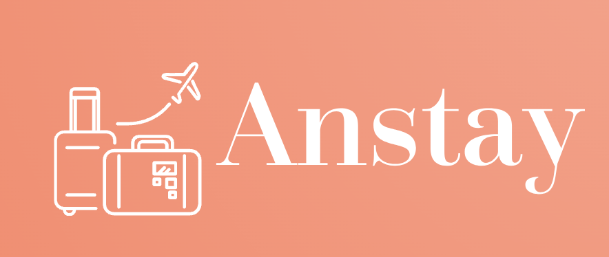

<h3 align="center">ANSTAY</h3>

### Features
- VueJS 3 - https://vuejs.org/guide/essentials/template-syntax.html 
- Tailwindcss - https://tailwindcss.com/docs/installation 
- Pinia
- Vue Router
- Font Awesome 5
- Google Font Roboto
- Fixed layout
- Script setup
- Basic of components and props
- Basic routing
- Include web manifest and icons
- Swiper v11.0.5 (slider) - https://swiperjs.com/get-started 
- v3 Infinite Loading v1.3.1 -https://www.npmjs.com/package/v3-infinite-loading 

### Clone This Repo
- <code>git clone https://github.com/truongnguyen0128/booking_project.git </code>
- <code>cd booking_project</code>
- <code>npm install</code>
- <code>npm run dev</code>
